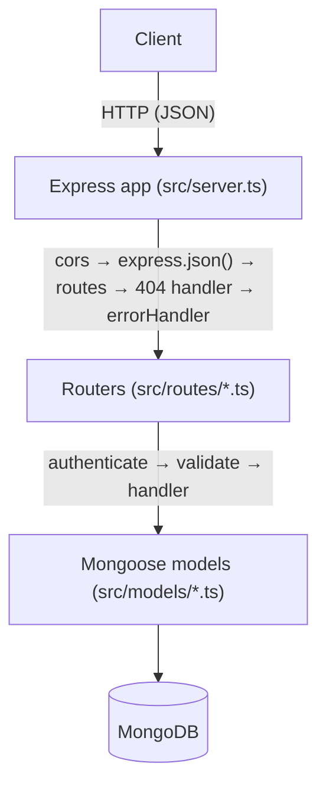
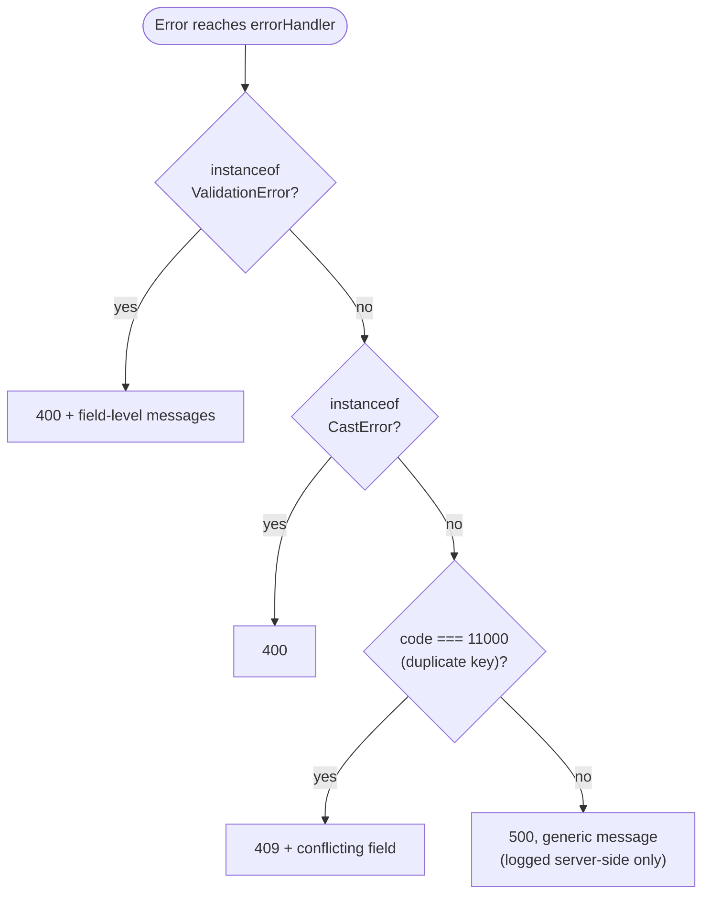
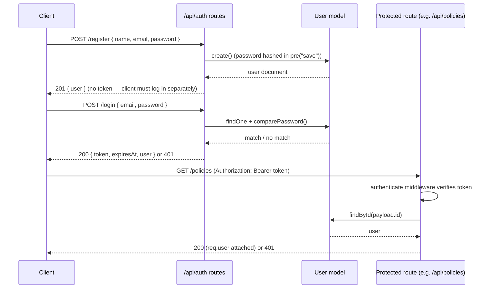
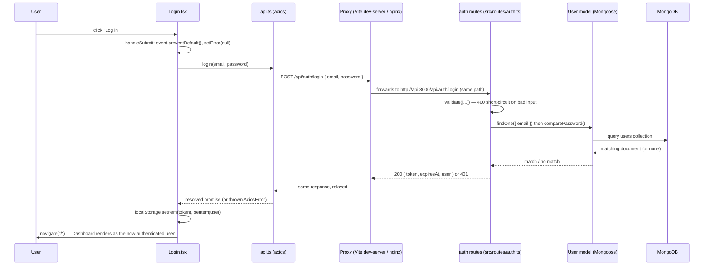
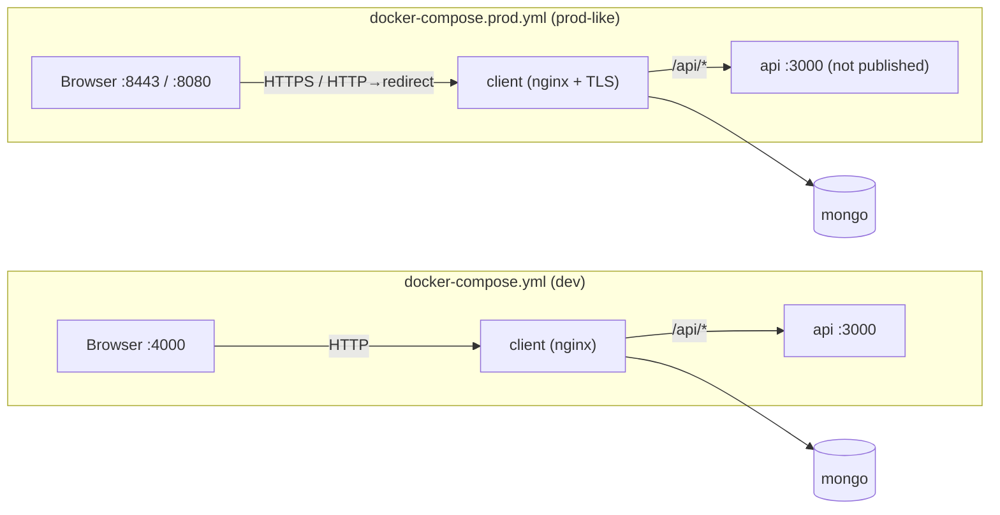
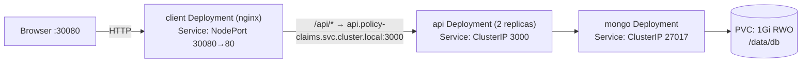

# Architecture

> All file paths below (`src/...`, `package.json`, etc.) are relative to [`backend-api/`](../backend-api/), where the application lives.

## Overview

A single Express application (`src/server.ts`) exposes a JSON REST API backed by MongoDB. A React client (`frontend-client/react-ts/`, documented separately in [its own README](../frontend-client/react-ts/README.md)) consumes this API; the two are developed and deployed independently, with the frontend's dev server proxying `/api` requests to this backend.

## Entry point

`src/server.ts` is the single entry point (there is no separate `app.ts`/`index.ts` split). In order, it:

1. Loads environment variables (`dotenv.config()`) — must happen before any other import touches `process.env`.
2. Configures the Express app: `cors()`, `express.json()`, the `/api/health` check, then mounts every router under `/api`.
3. Registers a 404 handler and the centralized `errorHandler` last.
4. Connects to MongoDB (`connectDB()`) and only then starts listening.

The server intentionally does **not** pass a callback to `app.listen()`. Express binds a passed callback to both the `listening` and `error` events, so on a port conflict it would still fire the "success" callback. Instead, `listening`/`error` are attached directly to the returned `http.Server`, so a real bind failure (e.g. `EADDRINUSE`) logs the actual error and exits non-zero instead of falsely reporting success.

## Request pipeline

Every protected route follows the same shape:

- **`authenticate`** (`src/middleware/auth.ts`) reads `Authorization: Bearer <token>`, verifies it with `JWT_SECRET`, loads the user, and attaches it as `req.user`. Returns 401 for any missing/invalid/expired token or a user that no longer exists.
- **`validate`** (`src/middleware/validate.ts`) takes an array of `express-validator` chains, runs them, and returns 400 with error details if any fail — otherwise calls `next()`.
- Route handlers are `async` and assume Express 5's automatic forwarding of rejected promises to error-handling middleware — there's no manual `try/catch` per route.

Errors that reach the end of the chain are handled centrally by `src/middleware/errorHandler.ts`:

## Auth flow

## End-to-end login data flow

The auth flow above starts at `POST /login` — this traces the same request one layer further out, from the click in the browser down to MongoDB and back, to show how the frontend (`frontend-client/react-ts/`) and this backend fit together across the proxy in between.

A few things worth calling out at each hop:

- **`Login.tsx`** only owns form state (`email`/`password`/`error`) and delegates the actual request to `AuthContext`'s `login()` — the component itself never touches `localStorage` or axios directly.
- **`api.ts`**'s shared axios instance is what actually calls the network; its `baseURL` is always the relative `/api`, so the frontend never hardcodes a host — that's entirely the proxy's job (Vite's dev-server proxy locally, nginx's `/api/` `location` block under Docker/Kubernetes — see [Containerized deployment](#containerized-deployment) and [Kubernetes deployment](#kubernetes-deployment) above).
- **The proxy is a pure pass-through for this route** — it doesn't add or check auth itself; `/api/auth/login` is one of the two routes (with `/api/auth/register`) that skip the `authenticate` middleware entirely (see [Request pipeline](#request-pipeline)).
- **On success**, `AuthContext.login()` (not `Login.tsx`) writes `token`/`user` to `localStorage` and updates React state — that state change is what makes `ProtectedRoute` stop redirecting to `/login` on the next render, which is why `navigate("/")` immediately after `login()` resolves lands on a page that renders instead of bouncing back.
- **On failure**, the rejected promise propagates back up to `Login.tsx` unchanged; `getErrorMessage()` extracts a display string from the Axios error, and nothing is written to `localStorage`.

## Data layer

Models live in `src/models/` and are plain Mongoose schemas:

- **`User`** — hashes its password in a `pre("save")` hook (bcrypt, 12 rounds) and strips `password` from `toJSON()` output.
- **`Policy`** — owned by a `User` (`owner` ref); `policyNumber` is uppercased/trimmed and unique.
- **`Claim`** — references a `Policy` and an `assignedTo` `User`; auto-generates a sequential `claimNumber` (`CLM-1000`, `CLM-1001`, …) in a `pre("save")` hook based on `countDocuments()`, and embeds `notes` as sub-documents (`{ author, text, createdAt }`).

See [`DESIGN.md`](DESIGN.md) for the reasoning behind these choices, including an entity-relationship diagram of how the three models relate.

## Containerized deployment

Two Compose files at the repo root (`docker-compose.yml`, `docker-compose.prod.yml`) wrap the same three pieces — `mongo`, `api` (`backend-api/Dockerfile`), `client` (`frontend-client/Dockerfile`) — into containers; see the root [README](../README.md#running-with-docker) for how to run them. The main difference between the two is how the client is fronted:

In both cases nginx (baked from `frontend-client/nginx.conf` or, in prod, `nginx-ssl.conf` bind-mounted over it) serves the built SPA and proxies `/api/*` to the `api` service, so the browser only ever talks to one origin — the same shape as the Vite dev-server proxy used outside Docker. `docker-compose.prod.yml` additionally mounts a self-signed cert (`generate-certs.sh`) and does not publish the `api` port to the host at all, since only the `client` container needs to reach it.

Both nginx configs are deployed as `/etc/nginx/templates/*.template` (not copied straight into `conf.d`), so the base nginx image's entrypoint can `envsubst` two values into them at container startup, rather than hardcoding Docker-Compose-specific behavior that would break elsewhere:

- `resolver ${NGINX_LOCAL_RESOLVERS}` — read from the container's own `/etc/resolv.conf` (Docker's embedded DNS under Compose, CoreDNS under Kubernetes) instead of a hardcoded `127.0.0.11`, which doesn't exist outside Compose.
- `set $backend_upstream ${API_UPSTREAM}` — the API's address, since nginx's built-in resolver does its own DNS queries and, unlike glibc/musl, doesn't apply `/etc/resolv.conf`'s search domains — so a bare `api` hostname that Docker's DNS resolves fine fails against CoreDNS, which needs the fully-qualified Service name. Defaults to `api:3000` (the Dockerfile `ENV`, correct for Compose); overridden per-deployment where it isn't (see `k8s/client.yaml` below).

## Kubernetes deployment

`k8s/` mirrors the same three pieces as a third deployment option, in a dedicated `policy-claims` namespace; see the root [README](../README.md#running-on-kubernetes) for how to run it.

Differences from the Compose setup, beyond the resolver/upstream substitution above:

- **Config via Secret, not compose `environment:`.** `api`'s Deployment loads `PORT`, `NODE_ENV`, `JWT_SECRET`, `MONGODB_URI` from a single `policy-claims-secrets` Secret via `envFrom`. `k8s/secrets.yaml` in the repo is a placeholder-only template (real values are never committed) — the live Secret is created imperatively (`kubectl create secret ... --from-literal=...`), and since env vars are only injected at container start, changing the Secret later requires `kubectl rollout restart deployment/api` to take effect.
- **Health probes are load-bearing.** `api`'s readiness probe (`GET /api/health`, 5s initial delay / 10s period) gates whether a replica receives traffic at all — relevant since it runs 2 replicas here versus 1 `api` container under Compose — and the liveness probe (same endpoint, 10s/30s) restarts a replica that stops responding.
- **`imagePullPolicy: Never` on both `api` and `client`.** Neither Deployment pulls from a registry; images must already exist on the node under the exact tag referenced (`p3-capstone-api:latest`, `p3-capstone-client:latest`), which works out of the box on Docker Desktop since its Kubernetes node shares the host's Docker image store.
- **Mongo's PVC ties it to `strategy: Recreate`.** The Deployment (not a StatefulSet, since this is a single-replica dev setup) sets `strategy: Recreate` so Kubernetes fully terminates the old pod — releasing the `ReadWriteOnce` PVC — before starting a replacement, rather than attempting the default rolling update, which would try to schedule a second pod against a volume the first one still holds.

## Testing

The Vitest suite (`vitest.config.mts`) splits into two kinds of tests:

- **Pure unit tests** — no database: `Policy` model validation (via `.validate()` on an unsaved document), `generateToken`, the `validate` and `errorHandler` middleware, and `authenticate` (with the `User` model mocked via `vi.mock`).
- **DB-backed tests** — `User` and `Claim` models, since their behavior (password hashing, claim-number generation) only fires on `.save()`. These connect to a dedicated `policy-claims-test` MongoDB database via `src/test/db.ts` helpers, cleared between tests.

Because the DB-backed tests share one real external database, `vitest.config.mts` sets `fileParallelism: false` — running test files concurrently was observed to race one file's cleanup (`afterEach`) against another file's in-progress assertions, producing a flaky duplicate-key test. Running files sequentially trades a small amount of speed for determinism.

Route handlers themselves are not unit-tested directly — they're thin composition of already-tested middleware and models. They were verified manually end-to-end against a live server and MongoDB instance during development (auth flows, CRUD lifecycles, filtering/pagination, aggregation, and error paths).
