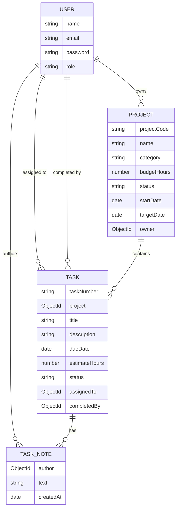
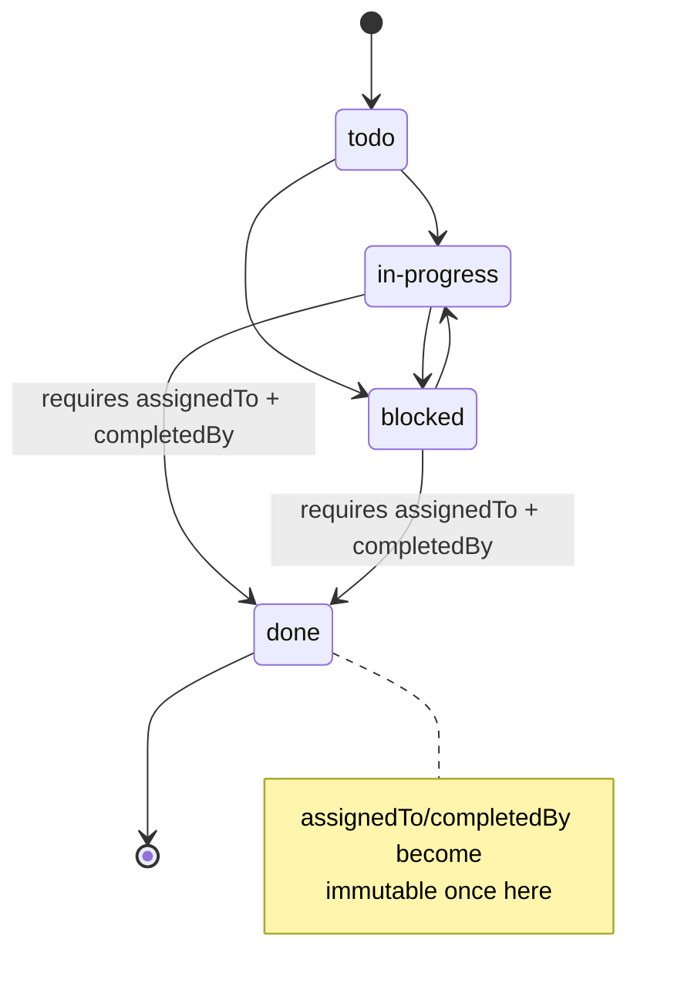

# Design

This document covers the data model and API design decisions behind the tracker, and the tradeoffs made along the way. For how the code is wired together, see [`ARCHITECTURE.md`](ARCHITECTURE.md).

> All file paths below (`src/...`, etc.) are relative to [`backend-api/`](../backend-api/), where the application lives.
>
> The [Swagger UI](ARCHITECTURE.md#api-documentation-swagger--openapi) (`/api/docs`, generated from the route code itself) is the authoritative, always-current reference for exact request/response shapes. The [API reference](#api-reference) below covers the same routes at a narrative level — why they're shaped the way they are — and can drift a line behind the code between updates; the generated spec cannot.

## Data model

### User

| Field | Type | Notes |
|---|---|---|
| `name` | String | required, trimmed |
| `email` | String | required, unique, lowercased, trimmed |
| `password` | String | required, min 8 chars, hashed with bcrypt (12 rounds) in a `pre("save")` hook |
| `role` | `"admin" \| "lead" \| "member"` | defaults to `member` |
| `createdAt` | Date | defaults to now |

The password is only rehashed when `isModified("password")` is true, so updating unrelated fields (e.g. `name`) doesn't churn the hash. `toJSON()` strips `password` so it's never accidentally serialized in an API response, even though the field is still fetched from the DB (needed for `comparePassword`).

`role` isn't currently used to gate any route — every authenticated user can read/write every project and task — it's stored and returned so the frontend can show it (see the Banner's role badge) and so authorization can be layered in later without a data-model migration.

### Project

| Field | Type | Notes |
|---|---|---|
| `projectCode` | String | required, unique, uppercased, trimmed |
| `name` | String | required, trimmed |
| `category` | `"web" \| "mobile" \| "data"` | required |
| `budgetHours` | Number | required, min 0 |
| `status` | `"active" \| "on-hold" \| "completed"` | required |
| `startDate` / `targetDate` | Date | required |
| `owner` | ObjectId ref → `User` | required, set from the authenticated user on creation |
| `createdAt` | Date | defaults to now |

`projectCode` is uppercased at the schema level so `"prj-100"` and `"PRJ-100"` are treated as the same project and collide on the unique index — this is enforced by MongoDB, and a duplicate submission surfaces as a 409 via the centralized error handler rather than a raw 500.

### Task

| Field | Type | Notes |
|---|---|---|
| `taskNumber` | String | unique, **auto-generated** (`TSK-1000`, `TSK-1001`, …) |
| `project` | ObjectId ref → `Project` | required |
| `title` | String | required |
| `description` | String | optional, trimmed |
| `dueDate` | Date | required |
| `estimateHours` | Number | optional, min 0 |
| `status` | `"todo" \| "in-progress" \| "blocked" \| "done"` | defaults to `todo` |
| `assignedTo` | ObjectId ref → `User` | optional |
| `completedBy` | ObjectId ref → `User` | optional |
| `notes` | `[{ author: ObjectId → User, text: String, createdAt: Date }]` | embedded sub-documents, no separate `_id` |
| `createdAt` / `updatedAt` | Date | via schema `{ timestamps: true }` |

**Task number generation** happens in a `pre("save")` hook: on a new document with no `taskNumber` yet, it calls `countDocuments()` on the collection and derives `TSK-${1000 + count}`. This keeps numbers human-readable and roughly sequential without a separate counter collection.

> **Known tradeoff:** this counter approach has a race condition under concurrent inserts — two tasks saved at the same instant could compute the same count and collide on the unique index. At this project's expected scale (a small team creating tasks, not a high-throughput system) that's an acceptable risk; a dedicated atomic counter document (`findOneAndUpdate` with `$inc`) would be the fix if that assumption changes. The seed script (`src/seed.ts`) sidesteps this entirely by creating tasks sequentially rather than in parallel.

Notes are embedded rather than a separate collection because they're always accessed in the context of their task, never independently queried or paginated — embedding avoids an extra join/populate for what is effectively a task's activity log.

**Status transitions are only partially enforced.** `todo`/`in-progress`/`blocked` can be set freely regardless of the task's current status — there's no workflow engine gating those. `done` is the one status with real invariants, enforced in both `POST /api/tasks` and `PUT /api/tasks/:id`:

- Setting `status: "done"` is rejected (400) unless both `assignedTo` and `completedBy` are already set on the task or provided in the same request — a task can't be "done" with nobody recorded as having done it.
- Once a task is `done`, further requests that try to change `assignedTo`/`completedBy` are rejected (400) — those two fields are locked in place rather than silently rewritable after the fact, since they represent a historical record of who finished the work.

## API design

- **Resource-oriented REST.** `/api/projects` and `/api/tasks` follow standard REST verbs (`GET`/`POST`/`PUT`/`DELETE`), with one deliberate extra: `POST /api/tasks/:id/notes` as a sub-resource action, since appending a note isn't really "replacing" the task (a `PUT` would imply that).
- **Pagination** is `page`/`limit` query params (default 1/10, capped at 100) on both list endpoints, returning `{ items, pagination: { page, limit, total, pages } }`. Kept minimal (offset-based) rather than cursor-based since the dataset sizes here don't warrant it.
- **Filtering** is done via query params matched directly to indexed/enum fields (`category`, `status` for projects; `status`, `project`, `assignedTo`, `completedBy` for tasks) plus a `search` param that does a case-insensitive regex match across the couple of free-text fields that make sense to search (`name`/`projectCode` for projects, `taskNumber`/`title` for tasks). Search input is regex-escaped before being used to avoid a user-supplied pattern breaking the query or causing catastrophic backtracking.
- **Validation happens before the database is touched.** `express-validator` chains run in the `validate` middleware ahead of every mutating route, so most bad input (missing fields, invalid enums, malformed ObjectIds) never reaches Mongoose. The centralized error handler's `ValidationError`/`CastError` branches exist as defense-in-depth for anything that bypasses that layer (a script, a future route), not as the primary validation path.
- **`GET /api/tasks/stats` is registered before `GET /api/tasks/:id`** — otherwise Express would match `/stats` as an `:id` param and route it to the wrong handler.
- **Dashboard vs. per-resource stats.** `/api/tasks/stats` and `/api/dashboard` overlap (both surface tasks-by-status and totals) by design: `/tasks/stats` is scoped to tasks for a tasks-focused view, while `/dashboard` aggregates across tasks, projects, and users for an at-a-glance summary. Duplicating the small aggregation pipeline was judged simpler than building a shared abstraction for two call sites.

### API reference

All routes are mounted under `/api` (see `src/app.ts`). "Auth" is `Authorization: Bearer <token>` via the `authenticate` middleware, which loads the user by the token's `id` and 401s on a missing/invalid/expired token. Every body/query field below is enforced by an `express-validator` chain in the route (`src/routes/*.ts`) before the handler runs — a failing chain returns `400` with an `errors` list from the shared `validate` middleware, not the handler's own logic.

#### Health

| | |
|---|---|
| **`GET /api/health`** | Auth: none |

No parameters. Returns `{ status: "ok" \| "error", db: "connected" \| "disconnected" \| "connecting" \| "disconnecting" \| "unknown" }`, `503` when `db` isn't `"connected"`.

#### Auth (`/api/auth`)

| | |
|---|---|
| **`POST /api/auth/register`** | Auth: none |

Body:

| Field | Type | Required | Constraints |
|---|---|---|---|
| `name` | string | yes | non-empty (trimmed) |
| `email` | string | yes | valid email; normalized (lowercased) |
| `password` | string | yes | min 8 chars |
| `role` | `"admin" \| "lead" \| "member"` | no | defaults to `member` |

`409` if `email` is already registered. `201` with `{ user }` (no token — log in separately).

| | |
|---|---|
| **`POST /api/auth/login`** | Auth: none |

Body: `email` (string, required, valid email), `password` (string, required, non-empty).

`401` on no matching user or wrong password. `200` with `{ token, expiresAt, user }`.

| | |
|---|---|
| **`GET /api/auth/me`** | Auth: required |

No parameters. Returns `{ user }` for the authenticated token.

| | |
|---|---|
| **`GET /api/auth/users`** | Auth: required |

No parameters. Returns `{ users }` — every user, oldest first — used to populate assignment dropdowns in the client.

#### Projects (`/api/projects`)

| | |
|---|---|
| **`GET /api/projects`** | Auth: required |

Query params (all optional):

| Param | Type | Constraints |
|---|---|---|
| `category` | string | one of `web`, `mobile`, `data` |
| `status` | string | one of `active`, `on-hold`, `completed` |
| `search` | string | case-insensitive match against `name` or `projectCode` |
| `page` | integer | `>= 1`; defaults to `1` |
| `limit` | integer | `1`-`100`; defaults to `10` |

Returns `{ projects, pagination: { page, limit, total, pages } }`, sorted by `createdAt` descending.

| | |
|---|---|
| **`GET /api/projects/:id`** | Auth: required |

Path: `id` (MongoDB ObjectId, required). `404` if not found. Returns `{ project }` with `owner` populated (password excluded).

| | |
|---|---|
| **`POST /api/projects`** | Auth: required |

Body:

| Field | Type | Required | Constraints |
|---|---|---|---|
| `projectCode` | string | yes | non-empty (trimmed) |
| `name` | string | yes | non-empty (trimmed) |
| `category` | string | yes | one of `web`, `mobile`, `data` |
| `budgetHours` | number | yes | `>= 0` |
| `status` | string | yes | one of `active`, `on-hold`, `completed` |
| `startDate` | string | yes | ISO 8601 date |
| `targetDate` | string | yes | ISO 8601 date |

`owner` is set to the authenticated user, not accepted from the body. `409` on a duplicate `projectCode`. `201` with `{ project }`.

| | |
|---|---|
| **`PUT /api/projects/:id`** | Auth: required |

Path: `id` (ObjectId, required). Body: same fields as `POST`, all optional (each still validated when present). `404` if not found. Returns `{ project }`.

| | |
|---|---|
| **`DELETE /api/projects/:id`** | Auth: required |

Path: `id` (ObjectId, required). `404` if not found, else `204` with no body.

#### Tasks (`/api/tasks`)

| | |
|---|---|
| **`GET /api/tasks`** | Auth: required |

Query params (all optional):

| Param | Type | Constraints |
|---|---|---|
| `status` | string | one of `todo`, `in-progress`, `blocked`, `done` |
| `project` | string | MongoDB ObjectId |
| `assignedTo` | string | MongoDB ObjectId |
| `completedBy` | string | MongoDB ObjectId |
| `search` | string | case-insensitive match against `taskNumber` or `title` |
| `page` | integer | `>= 1`; defaults to `1` |
| `limit` | integer | `1`-`100`; defaults to `10` |

Returns `{ tasks, pagination: { page, limit, total, pages } }`, sorted by `createdAt` descending.

| | |
|---|---|
| **`GET /api/tasks/stats`** | Auth: required |

No parameters. Returns `{ totalTasks, totalEstimateHours, byStatus: { todo, "in-progress", blocked, done } }` (every status key present, `0` if unused). Registered before `/:id` so it isn't swallowed by the `:id` param route.

| | |
|---|---|
| **`GET /api/tasks/:id`** | Auth: required |

Path: `id` (ObjectId, required). `404` if not found. Returns `{ task }` with `project` fully populated and `assignedTo`/`completedBy` populated (password excluded).

| | |
|---|---|
| **`POST /api/tasks`** | Auth: required |

Body:

| Field | Type | Required | Constraints |
|---|---|---|---|
| `project` | string | yes | MongoDB ObjectId |
| `title` | string | yes | non-empty (trimmed) |
| `description` | string | no | — |
| `dueDate` | string | yes | ISO 8601 date |
| `estimateHours` | number | no | `>= 0` |
| `status` | string | no | one of `todo`, `in-progress`, `blocked`, `done`; defaults to `todo` |
| `assignedTo` | string | no | MongoDB ObjectId |
| `completedBy` | string | no | MongoDB ObjectId |

`taskNumber` is auto-generated and never accepted from the body. `400` if `status: "done"` is requested without both `assignedTo` and `completedBy` (see [Status transitions](#task) above). `201` with `{ task }`.

| | |
|---|---|
| **`PUT /api/tasks/:id`** | Auth: required |

Path: `id` (ObjectId, required). Body (all optional): same fields as `POST` minus `taskNumber`/creation-only concerns. `400` if the update would change `assignedTo`/`completedBy` on an already-`done` task, or would set `status: "done"` without both fields present. `404` if not found. Returns `{ task }`.

| | |
|---|---|
| **`POST /api/tasks/:id/notes`** | Auth: required |

Path: `id` (ObjectId, required). Body: `text` (string, required, non-empty, trimmed). Appends `{ author: <authenticated user>, text, createdAt: now }` to the task's embedded `notes` array. `404` if the task isn't found. `201` with `{ task }` (full task, including the new note).

| | |
|---|---|
| **`DELETE /api/tasks/:id`** | Auth: required |

Path: `id` (ObjectId, required). `404` if not found, else `204` with no body.

#### Dashboard (`/api/dashboard`)

| | |
|---|---|
| **`GET /api/dashboard`** | Auth: required |

No parameters. Returns:

| Field | Description |
|---|---|
| `totalTasks` | Count of all tasks |
| `tasksByStatus` | `{ todo, "in-progress", blocked, done }` (all keys present, `0` if unused) |
| `totalProjects` | Count of all projects |
| `projectsByCategory` | `{ web, mobile, data }` (all keys present, `0` if unused) |
| `totalUsers` | Count of all users |
| `recentTasks` | Most recent 5 tasks, `project` fully populated and `assignedTo` populated (password excluded) |
| `totalEstimateHours` | Sum of `estimateHours` across all tasks (`0`-valued/missing hours treated as `0`) |

## Security & auth

- **JWT payload is intentionally minimal** — just `{ id, role }` — to keep tokens small and avoid embedding data that could go stale (e.g. `name`/`email`) before the token expires. Anything else needed is fetched fresh via `authenticate` looking up the user by id on every request. Tokens expire 60 minutes after issuance.
- **Passwords never leave the server.** Hashed at rest (bcrypt, 12 rounds), stripped from every JSON response via `toJSON()`, and never logged.
- **CORS is currently unrestricted** (`cors()` with no `origin` option). Now that `frontend-client/react-ts/` exists, tightening this to `cors({ origin: process.env.CLIENT_ORIGIN })` is a known follow-up rather than a hypothetical one — it just hasn't been prioritized yet since the frontend's dev server proxies `/api` same-origin and there's no single deployed client origin to lock down to across the Docker/Kubernetes/EKS deployment options.
- **Health check reflects real DB state**, not just process liveness — `GET /api/health` reports `mongoose.connection.readyState` and returns 503 when MongoDB is unreachable, so uptime monitoring can distinguish "server up, DB down" from "all healthy."
